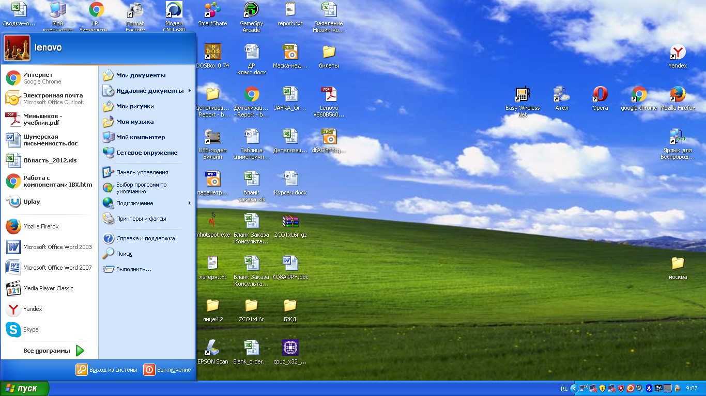
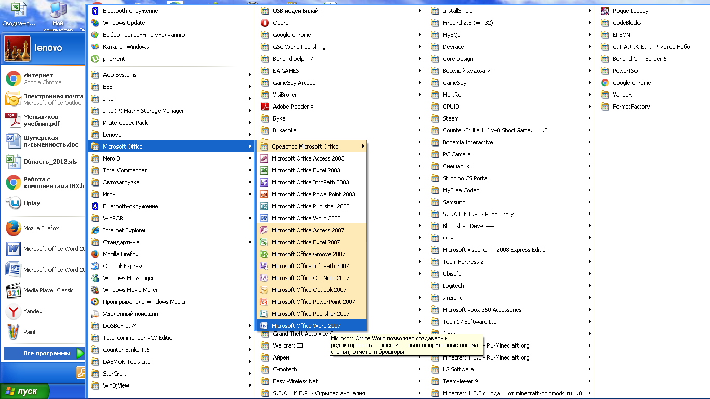
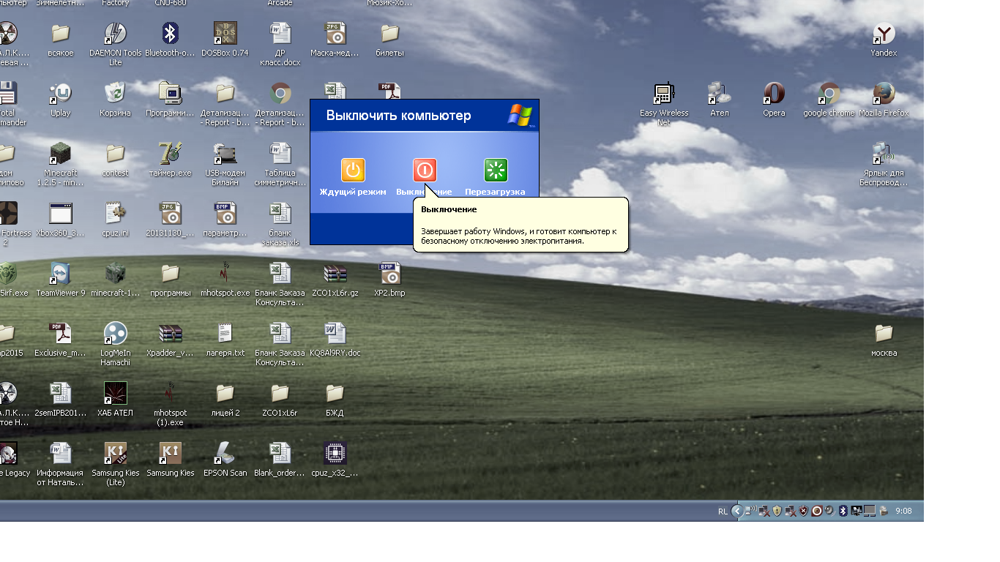
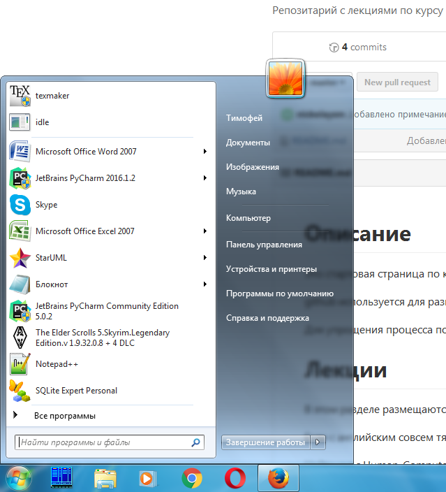
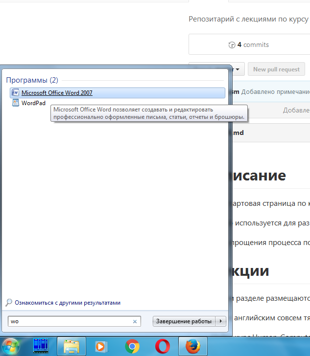

# Сравнение интерфейса меню "Пуск" в Windows 7 и Windows XP
По моему опыту самое распространённое действие после открытия меню - запуск установленного приложения, на втором месте - выключение.
В обеих операционных системах есть возможность закрепить приложение в меню пуск, а также панель с часто используемыми приложениями, что очень удобно. Однако в XP для запуска остальных нужно искать соответствующий каталог в списке, что не всегда удобно и отнимает время. Для выключения ПК в XP нужно выполнить 3 действия: Пуск->Выключение->Выключение. Поэтому данный интефейс я считаю неудобным.

В Windows 7 можно выполнить поиск приложения по названию, что очень удобно и часто экономит время. Для выключения ПК достаточно выполнить всего 2 действия: Пуск->Завершение работы. Поэтому данное интерфейсное решение я считаю боее удачным.

